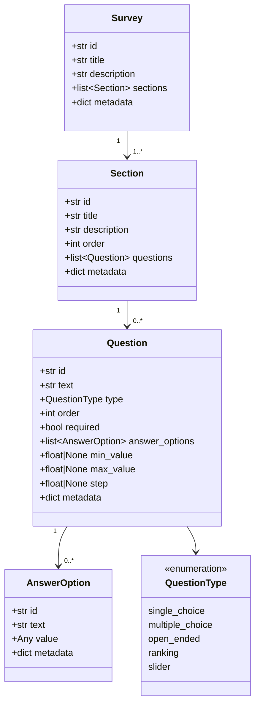
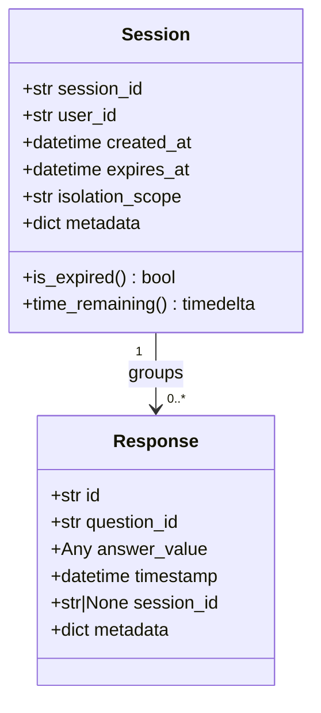
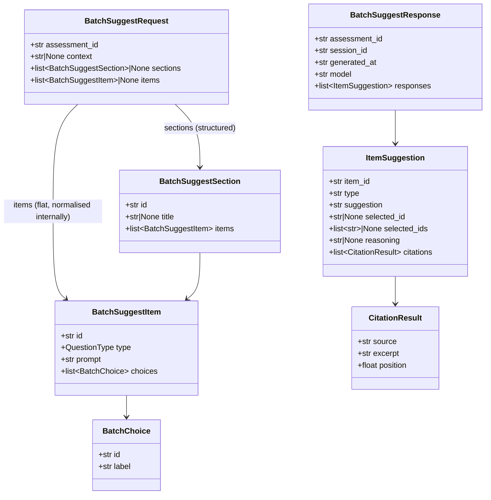
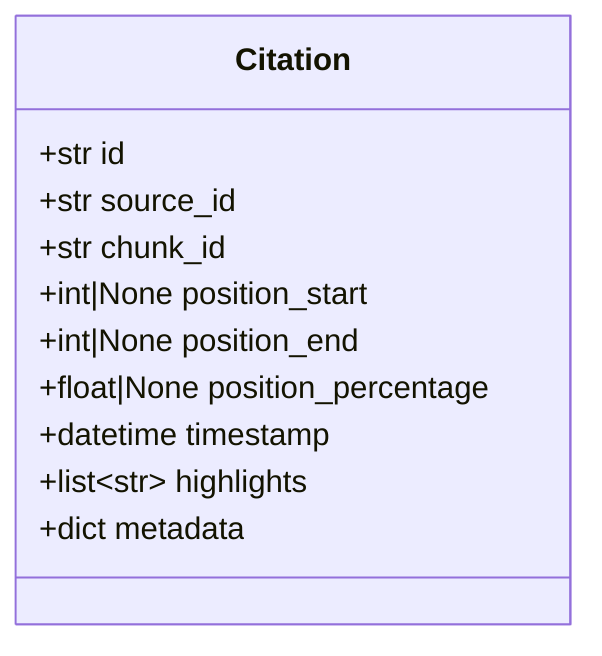
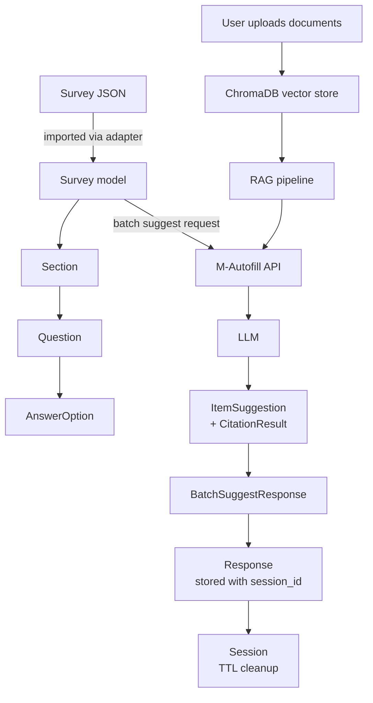

# Data Model

This document describes the internal data structures used across the Expats platform. The model is designed as a **platform-agnostic common denominator** — broad enough to represent questionnaires from a variety of survey tools, while staying simple enough to remain easy to work with.

---

## Design Philosophy

Questionnaire software varies widely, but most platforms share a few core concepts:

- A **survey** is a container of grouped questions
- Questions are organised into **sections** (sometimes called pages or groups)
- Each **question** has a type that determines how users respond
- For choice-based questions, a fixed set of **answer options** is provided
- A **response** captures what a user actually answered

Our model maps to these concepts while drawing on [QTI 3.0](https://www.imsglobal.org/spec/qti/v3p0/impl) (Question & Test Interoperability) as the primary reference standard. Compatibility with LimeSurvey, Qualtrics, and SurveyMonkey is achieved via a `metadata` escape hatch on every model — platform-specific fields that don't fit the common structure are preserved there rather than discarded.

---

## Core Model Hierarchy

---

## Question Types

| Type | Description | Requires `answer_options` | Requires `min/max_value` |
|---|---|---|---|
| `single_choice` | User picks exactly one option. Also covers yes/no, Likert scales. | Yes | No |
| `multiple_choice` | User picks one or more options. | Yes | No |
| `open_ended` | Free-text response. | No | No |
| `ranking` | User orders options by preference. | Yes | No |
| `slider` | User picks a numeric value within a defined range. | No | Yes |

These five types cover the vast majority of question styles found across QTI 3.0, LimeSurvey, Qualtrics, and SurveyMonkey. More exotic types (matrix/grid, media upload, date pickers) are out of scope for the current MVP.

---

## Answer Values by Type

The `Response.answer_value` field is flexible (`Any`) to accommodate the different shapes a response can take:

| Question type | `answer_value` shape | Example |
|---|---|---|
| `open_ended` | `str` | `"We store data for 3 years."` |
| `single_choice` | `str` (option id) | `"opt_2"` |
| `multiple_choice` | `list[str]` (option ids) | `["opt_1", "opt_3"]` |
| `ranking` | `list[str]` (ordered option ids) | `["opt_3", "opt_1", "opt_2"]` |
| `slider` | `float` | `7.5` |

---

## Session and Response Models

Responses are always tied to a **session**, which provides the isolation boundary and TTL-based cleanup. Sessions expire automatically (default: 24 hours) to enforce privacy-by-default data retention.

The `isolation_scope` field controls data partitioning (`user`, `org`, or `tenant`), supporting multi-tenant institutional deployments.

---

## M-Autofill API Models

The batch suggest API uses a **leaner parallel structure** optimised for the suggestion workflow. It mirrors the Survey/Section/Question hierarchy but strips out fields that are not needed at request time.

A request may supply either a flat `items` list or a structured `sections` list — not both. Flat items are automatically wrapped in a single implicit section before processing.

---

## Citation Model

Citations link each answer suggestion back to a specific fragment of a source document. This supports transparency and auditability requirements.

Position can be expressed as a character range (`position_start` / `position_end`) or as a normalised percentage (`position_percentage` from 0.0 to 1.0), following the [W3C TextQuoteSelector](https://www.w3.org/TR/annotation-model/#text-quote-selector) pattern.

---

## Full Data Flow

---

## Standards Alignment

| Concept | QTI 3.0 equivalent | LimeSurvey | Qualtrics |
|---|---|---|---|
| `Survey` | Assessment | Survey | Survey |
| `Section` | Section / TestPart | Question Group | Block |
| `Question` | Item | Question | Question |
| `AnswerOption` | Choice | Answer | Choice |
| `single_choice` | ChoiceInteraction (cardinality: single) | List Radio | Multiple Choice (single answer) |
| `multiple_choice` | ChoiceInteraction (cardinality: multiple) | Multiple Choice | Multiple Choice |
| `open_ended` | ExtendedTextInteraction | Free Text | Text Entry |
| `ranking` | OrderInteraction | Ranking | Rank Order |
| `slider` | SliderInteraction | Multiple Numerical Slider | Slider |

Platform-specific fields that do not fit this common structure are preserved in each model's `metadata: dict` field, ensuring lossless round-trip import/export.

---

## Source Files

| Model | File |
|---|---|
| `Survey` | [m_shared/models/survey.py](../m_shared/models/survey.py) |
| `Section` | [m_shared/models/section.py](../m_shared/models/section.py) |
| `Question`, `QuestionType` | [m_shared/models/question.py](../m_shared/models/question.py) |
| `AnswerOption` | [m_shared/models/answer_option.py](../m_shared/models/answer_option.py) |
| `Response` | [m_shared/models/response.py](../m_shared/models/response.py) |
| `Session` | [m_shared/models/session.py](../m_shared/models/session.py) |
| `Citation` | [m_shared/models/citation.py](../m_shared/models/citation.py) |
| Batch API models | [cue_api/models.py](../cue_api/models.py) |
